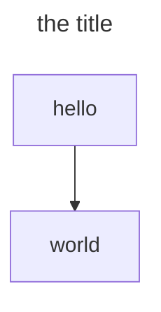
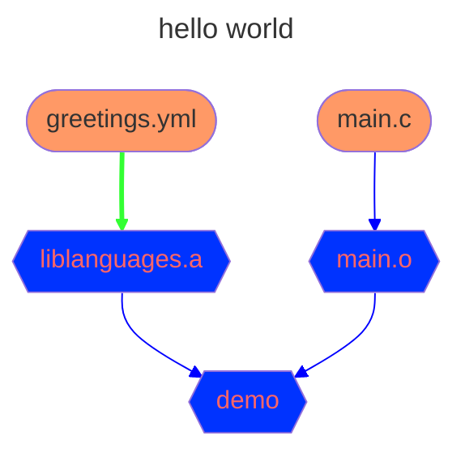

# bar 1

```mermaid

---
title: the title

animate:
  nb_frames: 4
  delay: 500
  frames:
    - 
        - X
        - Y
    -
        - X
        - Z

---

flowchart TD

hello --> world

%% mermaid-animate Z hello --> other ;


%% mermaid-animate Z hello:::chello ;
%% mermaid-animate Y hello([hello]):::chello ;

%% mermaid-animate S classDef chello stroke:#3f3,stroke-width:3px,color:red;
%% mermaid-animate X classDef chello stroke:#3f3,stroke-width:10px,color:blue;
%% mermaid-animate Y classDef chello stroke:#3f3,stroke-width:3px,color:red;

classDef world stroke:#blue,stroke-width:1px,fill:orange,color:red;

%% class hello chello ;


```

---

# bar 2

```mermaid

---
title: hello world

animate:
    nb_frames: 4
    delay: 500
    frames:
        - 
            - X
            - Y
        -
            - X
            - Z

---

flowchart

    greetings_yml([greetings.yml]):::source
    main_c([main.c]):::source
    main_o{{main.o}}:::ofile
    liblanguages_a{{liblanguages.a}}:::ofile
    demo{{demo}}:::ofile

    main_c ec1@--> main_o
    liblanguages_a ec3@--> demo
    main_o ec4@--> demo
    greetings_yml ex1@--> liblanguages_a


    classDef source fill:#f96
    classDef generated fill:#bbf,stroke:#f66,stroke-width:2px,color:#fff,stroke-dasharray: 5 5
    classDef ofile fill:#03f,color:#f66

    classDef e_htosource stroke:#aaa,stroke-width:0.7x ,stroke-dasharray: 10,5;
    class es1,es2,es3,es4,es5,es6,es7,es8,es9,es10 e_htosource;

    classDef e_generate stroke:#f00,stroke-width:1px;
    class eg1,eg2,eg3,eg4,eg5,eg6,eg7 e_generate;

    classDef e_compile stroke:#00f,stroke-width:1px;
    class ec1,ec2,ec3,ec4,ec5,ec6,ec7 e_compile;

    classDef e_expand stroke:#3f3,stroke-width:3px,color:red;
    class ex1,ex2,ex3,ex4,ex5,ex6,ex7 e_expand;

```
