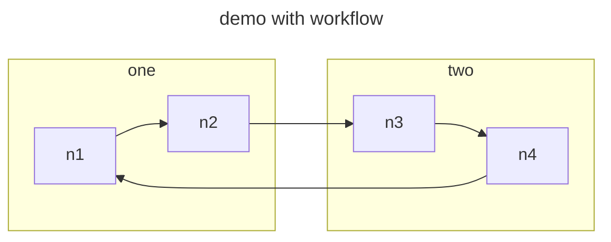

# flowchart

# demo1

```mermaid

---

title: demo with workflow

animate:
  delay: 500
  tags: [n1,n2,n3,n4]
  variants: 
    - name: on
      value: 'class {tag} class_on;'
    - name: off
      value: 'class {tag} class_off;'
    - name: hidden
      value: 'class {tag} class_grey;'

  frames:
    - title: |
        <p style="background-color:FireBrick;color:GreenYellow">user label for frame 1, foo</p>
      toggles: [ n1@on , n2@off ,  n3@hidden ,  n4@hidden ]

    - title: |
        <p style="background-color:aquamarine;color:black">user label for frame 2, foo</p>
      toggles: [n1@off ,  n2@on ]

    - title: |
        <p style="background-color:coral;color:GreenYellow">user label for frame 3, foo</p>
      toggles: [ n1@hidden ,  n2@hidden ,  n3@on ]

    - title: |
        <p style="background-color:Purple;color:GreenYellow">user label for frame 4, foo</p>
      toggles:
        - n3@off
        - n4@on


---

flowchart LR

subgraph one
    n1
    n2
end

subgraph two
    n3 
    n4 
end

n1 --> n2
n2 --> n3
n3 --> n4
n4 --> n1


classDef class_on fill:green,stroke:red,stroke-width:5px,color:white ;
classDef class_off fill:lightgreen,stroke:white,stroke-width:5px,color:black ;
classDef class_grey fill:grey,stroke:grey,stroke-width:5px,color:black ;


%% mermaid-animate-tag n1
%% mermaid-animate-tag n2
%% mermaid-animate-tag n3
%% mermaid-animate-tag n4


```
