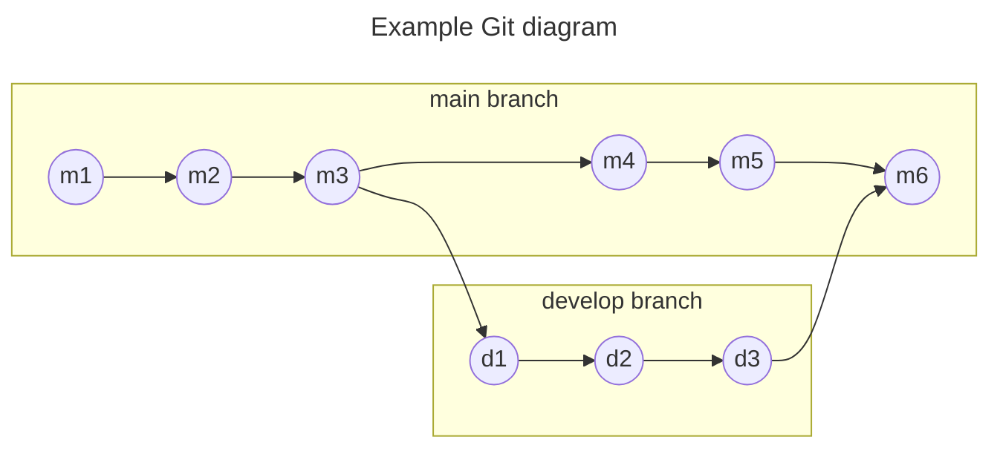

# git

## without linear commit 

```mermaid
---
title: Example Git diagram

animate-yml-file: git-animate.yml

---

flowchart LR

subgraph main branch
    m1 
    m2 
    m3 
    m4 
    m5 
    m6
end

subgraph develop branch
    m3 
    d1 
    d2 
    d3
end

m1 em1m2@-->m2
m2 em2m3@-->m3
m3 em3m4@-->m4
m4 em4m5@-->m5
m5 em5m6@-->m6

m3 em3d1@-->d1
d1 ed1d2@-->d2
d2 ed2d3@-->d3
d3 ed3m6@-->m6

m1((m1)) ;
m2((m2)) ;
m3((m3)) ;
m4((m4)) ;
m5((m5)) ;
m6((m6)) ;

d1((d1)) ;
d2((d2)) ;
d3((d3)) ;

classDef class_on      stroke-width:1px,color:black,stroke:black ;
classDef class_from    stroke:green,stroke-width:5px,color:black ;
classDef class_to      stroke:red,stroke-width:5px,color:black ;
classDef class_off     stroke-width:1px,color:white,stroke:white ;
classDef class_edge    stroke-width:1px,color:black,stroke:black;
classDef class_no_edge stroke-width:1px,stroke:white ;
classDef animate stroke-dasharray: 9,5,stroke-dashoffset: 900,animation: dash 25s linear infinite,color black;


%% mermaid-animate-tag m1
%% mermaid-animate-tag m2
%% mermaid-animate-tag m3
%% mermaid-animate-tag m4
%% mermaid-animate-tag m5
%% mermaid-animate-tag m6

%% mermaid-animate-tag d1
%% mermaid-animate-tag d2
%% mermaid-animate-tag d3


%% mermaid-animate-tag em1m2
%% mermaid-animate-tag em2m3
%% mermaid-animate-tag em3m4
%% mermaid-animate-tag em4m5
%% mermaid-animate-tag em5m6
%% mermaid-animate-tag em3d1
%% mermaid-animate-tag ed1d2
%% mermaid-animate-tag ed2d3

%% mermaid-animate-tag ed3m6


```

