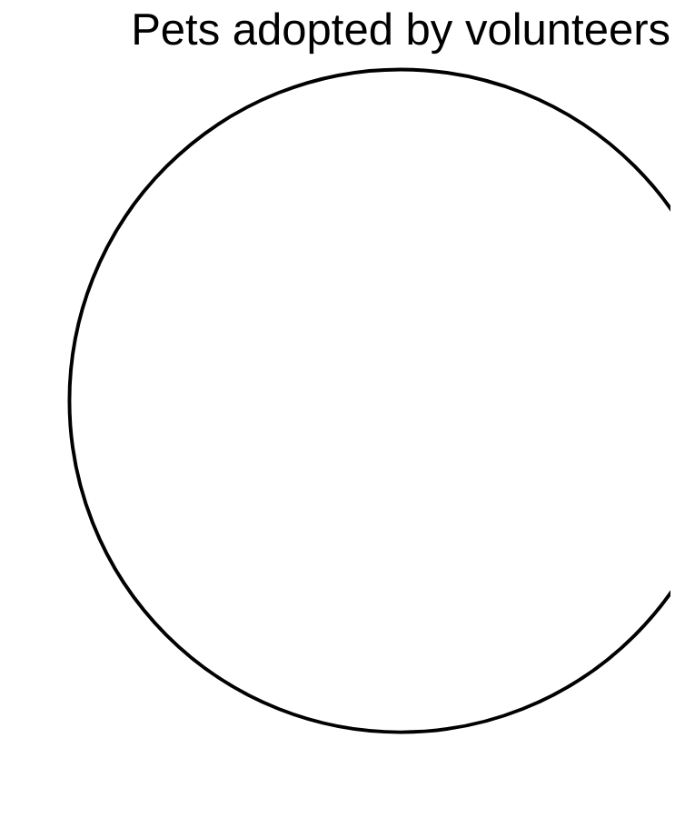

# pie

```mermaid

---

title: pie

animate:
  delay: 800

  tags: [scenario]

  variants: 
    - name: sc-1
      value:  |
        "Dog" : 300
        "Cat" : 100
        "Rat" : 10
    - name: sc-2
      value: |
        "Dog" : 350
        "Cat" : 100
        "Rat" : 34


  frames:
    - title: |
          <h1 style="background-color:FireBrick;color:GreenYellow">year 2020</h1>
      toggles: [ scenario@sc-1 ]

    - title: |
          <h1 style="background-color:aquamarine;color:black">year 2025</h1>
      toggles: [ scenario@sc-2 ]


---
pie title Pets adopted by volunteers
%% mermaid-animate-tag scenario


```
