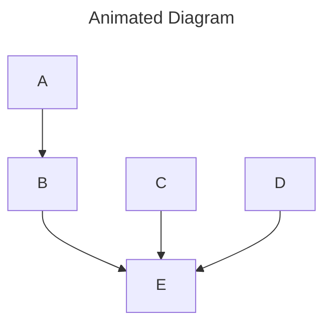

<!-- toc -->

---

# demo
[top](#top)

```mermaid

---

title: Animated Diagram
animate:
  debug: true
  delay: 1000
  tags:
    - tag: A
      variants:
        - name: red
          value: class A red;
        - name: blue
          value: class A blue;
    - tag: B
      variants:
        - name: red
          value: class B red;
        - name: blue
          value: class B blue;  
  frames:
    - title: |
        <h3>
        <p style="background:coral">
        some title for frame 1
        </p>
        </h3>
      toggles:
        - A@red
        - B@blue
    - title: |
        <h3>
        <p style="background:aquamarine">
        some title for frame 2
        </p>
        </h3>
      toggles:
        - A@blue
---
graph TD;


    A-->B;  
    B-->E;
    C-->E;
    D-->E;


    classDef red fill:#f96,stroke:#333,stroke-width:2px;
    classDef blue fill:#bbf,stroke:#333,stroke-width:2px;

    %% mermaid-animate-tag A
    %% mermaid-animate-tag B


```
